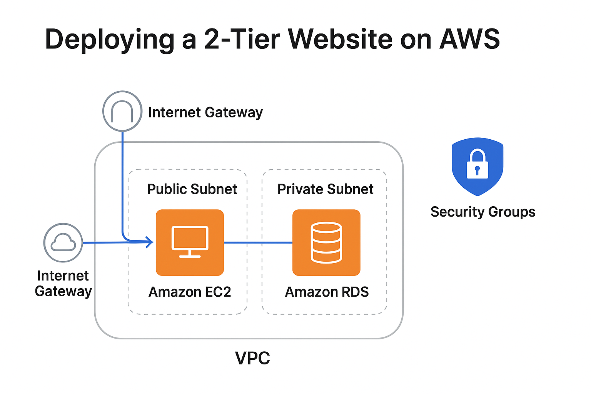

# Deploying a 2-Tier Website on AWS (Amazon Linux AMI)

This project demonstrates the deployment of a scalable **2-Tier Web Application** on AWS using a modular architecture that separates the **web (frontend)** and **database (backend)** layers.The goal is to apply AWS Well-Architected best practices across the pillars of **security, reliability, performance efficiency, cost optimization, and operational excellence**, while ensuring **high availability and fault tolerance**.

---

## Architecture

  

## Tools & Services
- **Amazon EC2 (Amazon Linux AMI + Apache/Nginx)** – Web server layer  
- **Amazon RDS (MySQL)** – Database backend  
- **Elastic Load Balancer (ALB)** – Distributes traffic across EC2 instances  
- **Auto Scaling Group (ASG)** – Automatically scales EC2 instances  
- **Amazon Route 53** – Domain registration and DNS routing  
- **Amazon VPC** – Public/private subnets, route tables, IGW, security groups  
- **Amazon CloudWatch** – Monitoring and auto-scaling triggers  

---

## Features
- **Scalable and modular 2-Tier design** separating frontend and backend  
- **Elastic Load Balancer (ALB)** for distributing traffic and ensuring high availability  
- **Auto Scaling Group (ASG)** for automatic scaling and self-healing  
- **Amazon Route 53** for professional domain registration and global DNS resolution  
- **Secure RDS MySQL backend** deployed in a private subnet  
- **VPC networking** with subnets, route tables, security groups, and firewall rules  

---

## Deployment Steps (High-Level)
1. **Provision VPC** with public/private subnets, route tables, and Internet Gateway.  
2. **Create Security Groups** for ALB, EC2, and RDS:  
   - ALB: Allow HTTP (80) from the internet  
   - EC2: Allow HTTP (80) from ALB, SSH (22) from admin IP  
   - RDS: Allow MySQL (3306) only from EC2  
3. **Launch Auto Scaling Group (ASG)** with EC2 instances in the public subnets.  
4. **Attach Elastic Load Balancer (ALB)** to distribute incoming traffic across EC2 instances.  
5. **Deploy Web Server** (Apache/Nginx) on EC2 via User Data script and upload website code.  
6. **Create Amazon RDS (MySQL) Instance** in the private subnet.  
7. **Connect EC2 to RDS** by updating the application configuration.  
8. **Set up Amazon Route 53** to map a custom domain to the ALB DNS.  
9. **Test the Application** using the Route 53 domain to verify end-to-end connectivity, load balancing, and scalability.  

---

## Outcome
- Deployed a **fully functional 2-Tier Web Application** on AWS.  
- Achieved **high availability and fault tolerance** with ALB and ASG.    
- Secured the backend with **RDS in a private subnet**.  
- Provided a **professional domain** accessible globally via Route 53.  
- Applied **AWS Well-Architected best practices** for security, scalability, reliability, and performance.  

