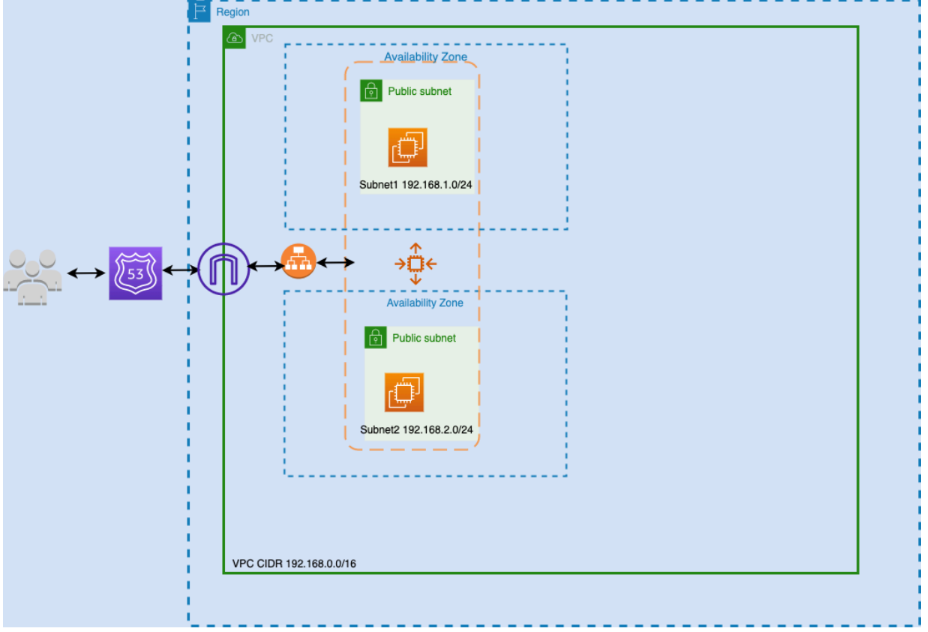

# Deploying a 2-Tier Website on AWS (Amazon Linux AMI)

This project demonstrates the deployment of a scalable **2-Tier Web Application** on AWS using a modular architecture that separates the **web (frontend)** and **database (backend)** layers.  
The goal is to showcase AWS best practices for scalability, reliability, and security.

---

## Architecture

  
*VPC → EC2 (Web Tier) → RDS (Database Tier))*

- **Frontend (Web Tier):** Amazon EC2 running Apache on Amazon Linux AMI  
- **Backend (Database Tier):** Amazon RDS (MySQL)  
- **Networking:** Custom VPC with public & private subnets, Internet Gateway, Security Groups  

---

## Features
- Scalable and modular 2-Tier design  
- Web server on Amazon EC2 (Amazon Linux AMI)  
- Secure RDS MySQL backend in private subnet  
- VPC networking with security groups and firewall rules  

---

## Deployment Steps (High-Level)

1. **Provision VPC** with public/private subnets and Internet Gateway.  
2. **Launch EC2 Instance** in the public subnet with Amazon Linux AMI.  
3. **Install Web Server** (Apache) and deploy website code.  
4. **Create RDS MySQL Instance** in the private subnet.  
5. **Configure Security Groups**:  
   - Allow HTTP (80) from the internet to EC2  
   - Allow MySQL (3306) from EC2 to RDS  
6. **Connect EC2 to RDS** by updating app configuration.  
7. **Test Application** using EC2 Public DNS.  

---

## Tools & Services Used
- **Amazon EC2** – Web tier hosting (Amazon Linux AMI + Apache)  
- **Amazon RDS (MySQL)** – Database backend  
- **Amazon VPC** – Networking (subnets, route tables, IGW, SGs)  
- **Security Groups** – Controlled access to web and DB tiers  

---

## Outcome
- Successfully deployed a modular 2-Tier Web Application  
- Improved scalability and maintainability by separating frontend and backend layers  
- Applied AWS networking and security best practices  
